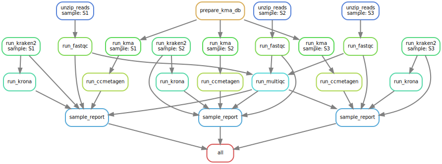

# FLARE

Workflow to analyse metagenomic samples.

> DAG gernated by: `snakemake --dag dot | dot -Tsvg > dag.svg`


## Kraken2

for kraken2 rules there is the option to load the database to tmpfs. For this, make sure you have a large enough tmpfs mounted somewhere and point the option `kraken2_tmpfs_path` in [config.yml](config/config.yml#L4).
Make sure to set `kraken2_use_tmpfs` to `true`, and if you want to keep the database there for future runs, set `notep` in [profiles/default/config.yaml](profiles/default/config.yaml#L2) to `true`

## `tmpfs` for large databases

Instead of loading large databases to memory for each process separately or manually moving it to `/dev/smh` we use a dedicated `tmpfs` mounted to `/mnt/database_tmp`:

```bash
sudo mkdir /mnt/database_tmpfs
sudo mount -t tmpfs -o size=200G tmpfs /mnt/database_tmpfs
sudo chown -R root:data /mnt/database_tmpfs
```


